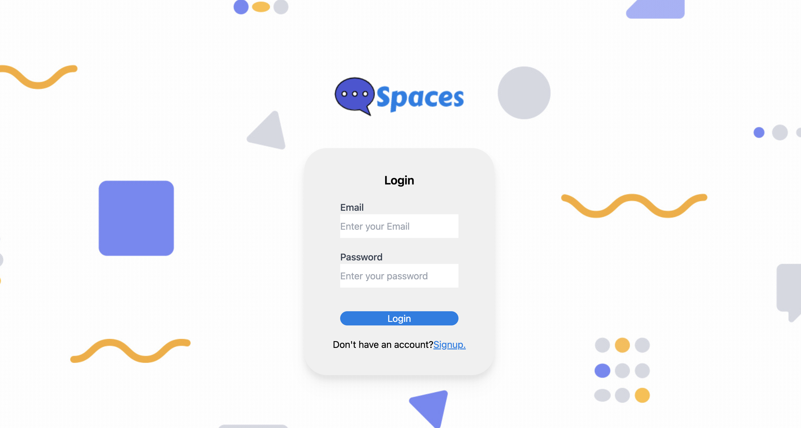

# Spaces Live Chat App

**Spaces** is a real-time room-based messaging application built with React, Tailwind CSS, Firebase, Node.js, Express, and Socket.IO.

## Project Overview

Spaces Live Chat enables authenticated users to join custom chat rooms and exchange messages in real time through WebSocket powered communication. The application operates by creating private conversation spaces where users can quickly authenticate, enter a shared room name, and begin chatting with ease. It was designed in mind for users who need a simple live messaging experience. Major functionality includes Firebase authentication, protected routes, dynamic room joining, active member visibility, responsive chat layouts, and Socket.IO event handling between the React client and the Express server. This project utilizes client-side state management, persistent authentication and room based WebSocket messaging provided by Socket.io in an easy to use React application.

## Features

- **Authentication:** Firebase email and password sign up, login, auth persistence, and logout flow.
- **Protected routes:** React Router guards prevent unauthenticated users from accessing the room and chat screens.
- **Real-time messaging:** Socket.IO enables bidirectional communication between users in the same chat room.
- **Room-based conversations:** Users can create or join rooms by entering a shared room name.
- **Active member list:** The server tracks connected users and broadcasts updated room and user data to the client.
- **Responsive design:** Tailwind CSS adds a layer of mobile responsiveness to this application. It supports phone, tablet, laptop, and desktop layouts.
- **API integrations:** This app utilizes Firebase Authentication, Firestore user documents, Firebase configuration, Socket.IO, and an Express API endpoint.
- **State management:** React Context manages authenticated user data and room state across routed views.
- **Error handling:** Login and signup flows surface invalid credential and duplicate account states to the user.
- **Dynamic UI behavior:** Chat bubbles render differently for the current user versus other room members. Also, the chat window auto scrolls to the latest message.
- **Performance optimizations:** Messages and user lists are scoped to local component state, room events are routed through Socket.IO. 

## Overall Application Structure

The application follows a client/server architecture where the React frontend handles user interaction, routing, rendering, and local UI state, while the Node.js backend coordinates room membership and real-time web socket connections using Socket.IO events. Data flows from Firebase Authentication into `AuthContext` , from the join-room form into `RoomContext`, and from Socket.IO events into component level state for messages and active members. API communication is split by Firebase handling identity and user persistence, Socket.IO handles live chat events, and Express exposes a small REST endpoint for basic server responses. Protected routes use that context to redirect unauthenticated users away from chat only screens. Error handling is handled close to the user action, with login and signup failures reflected in local component state.

## Component Architecture

### `App`

`App` is the root component for the React client and is responsible for defining the application routes, initializing the Socket.IO client connection, and providing room state through `RoomContext`. It manages the current room value with useState and reads authenticated user data from `AuthContext`. It passes the shared socket instance into pages that need real-time functionality, including login, signup, room joining, and live chat. Its ProtectedRoute wrapper coordinates with Firebase auth state so only signed-in users can access /join_room and /live_chat.

### `Login`

`Login` renders the sign-in screen and handles Firebase email and password authentication through signInWithEmailAndPassword. It manages an err state that controls whether invalid credential feedback appears after a failed login attempt. The component receives the shared socket prop. It interacts with React Router by navigating authenticated users to the room-joining flow and provides accessible form labels for email and password inputs.

### `Signup`

`Signup` handles new account creation with Firebase Authentication and stores user profile records in Firestore. It manages local err state for duplicate account or registration failures and uses Firebase updateProfile to attach a display name to the authenticated user. After successful account creation, it navigates users to the room selection screen. The form uses required fields, typed inputs, and explicit labels to support keyboard completion and basic accessibility expectations.

### `JoinRoom`

`JoinRoom` collects the room name that determines where the user will chat. It reads currentUser from `AuthContext`, updates room through RoomContext, emits joinRoom and newUser Socket.IO events, and navigates into the live chat experience. It receives the shared socket prop from `App` and uses that connection to synchronize room membership with the backend. The component keeps state management intentionally minimal by delegating persistent room data to context.

### `LiveChat`

`LiveChat` composes the authenticated chat experience by rendering the `Nav`, `ChatMembers`, and `ChatWindow` components inside a responsive shell. It receives the shared socket prop and passes it to child components that need to listen for user or message events. It maintains a local messages array for incoming Socket.IO responses, although message rendering is primarily handled inside `ChatWindow`. The layout hides the member panel on smaller phone widths to preserve readability and reduce horizontal crowding.

### `Nav`

`Nav` displays the current Firebase user display name, active room name, and logout action. It reads from both AuthContext and RoomContext, which keeps navigation status synchronized with the rest of the application. The component calls Firebase signOut when the user selects logout and includes a Heroicons logout icon for quick visual recognition. Its responsive text sizing helps preserve usability across phone, tablet, laptop, and desktop breakpoints.

### `ChatMembers`

`ChatMembers` displays the active connected users received from the Socket.IO server. It manages a users array in component state and updates that list when the server emits newUserResponse. The component receives the shared socket prop and maps each user by socketID to produce stable list items. It supports the broader chat layout by separating presence information from message rendering, which keeps responsibilities clear.

### `ChatWindow`

`ChatWindow` is responsible for composing, sending, receiving, and rendering chat messages. It manages the draft message, the displayed messages array, and a lastMessageRef used to scroll the conversation to the newest message. The component receives the shared socket prop, reads currentUser from AuthContext, reads room from RoomContext, emits message events to the backend, and listens for messageResponse events from other users. It applies conditional rendering so the current user's messages are visually distinguished from incoming messages, improving scanability during active conversations.

## Challenges Faced / What I Learned

Building this application required coordinating asynchronous systems that update at different times. Firebase handles auth state, React Router handled navigation, and Socket.IO managed connection state events. One challenge was ensuring users could only enter the live chat after Firebase confirmed their identity, which was solved with an authentication context and protected route wrapper. Another challenge was handling room-scoped messaging so users in one room did not receive every message emitted by the server. This was solved by joining Socket.IO rooms and broadcasting messages to the right specific channels. 

This project strengthened my understanding of how React applications can coordinate routed workflows, component state, and shared context in real SaaS projects. I learned how to use Firebase Authentication. I also gained practical experience designing components within a client/server infastructure. 

## Deployment

This project is hosted on Netlify while the backend is hosted on Heroku. 

The live application is available at: https://www.ms-spaces.com
